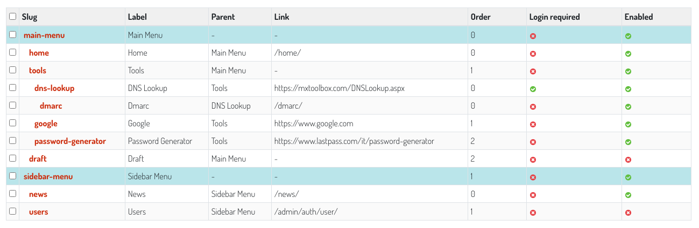

=============================
Django Lineup
=============================

.. image:: https://badge.fury.io/py/django-lineup.svg
    :target: https://badge.fury.io/py/django-lineup

.. image:: https://travis-ci.org/otto-torino/django-lineup.svg?branch=master
    :target: https://travis-ci.com/github/otto-torino/django-lineup

.. image:: https://codecov.io/gh/otto-torino/django-lineup/branch/master/graph/badge.svg
    :target: https://codecov.io/gh/otto-torino/django-lineup

Multiple navigation system for django sites.

Django Lineup lets you manage a tree of items. Each first level node represents a menu you can include in your templates.

Documentation
-------------

The full documentation is at https://django-lineup.readthedocs.io.

Quickstart
----------

Install Django Lineup::

    pip install django-lineup

Add it to your `INSTALLED_APPS`:

.. code-block:: python

    INSTALLED_APPS = (
        ...
        'lineup.apps.LineupConfig',
        ...
    )

Make sure the ``requests`` context processor is included (it is by default):

.. code-block:: python

    TEMPLATES = [
      {
        'OPTIONS': {
          'context_processors': [
            "django.template.context_processors.request",
          ],
        },
      },
    ]

Render a menu:::

    
    

Render the breadcrumbs:::

    
    

Import a menu from a json:::

    $ python manage.py import_menu_from_json

Json example:::

    {
      "label": "Main Menu",
      "slug": "main-menu",
      "order": 0,
      "children": [
        {
          "label": "Tools",
          "slug": "tools",
          "order": 0,
          "children": [
            {
              "label": "DNS Tools",
              "slug": "dns-tools",
              "order": 0,
              "login_required": true,
              "children": [
                {
                  "label": "DMARC DNS Tools",
                  "slug": "dmarc-dns-tools",
                  "link": "/dmarc-tools/",
                  "title": "DMARC Rulez",
                  "order": 0
                }
              ]
            },
            {
              "label": "Password Generator",
              "slug": "password-generator",
              "order": 1
            }
          ]
        },
        {
          "label": "Disabled Item",
          "slug": "disabled-item",
          "order": 1,
          "enabled": false,
          "children": [
            {
              "label": "Disabled child",
              "slug": "disabled-child",
              "order": 0
            }
          ]
        },
        {
          "label": "Perm Item",
          "slug": "perm-item",
          "order": 2,
          "permissions": [
            "add_permission",
            "view_session"
          ]
        }
      ]
    }

Features
--------

- Multiple menus supported
- Visibility logic: login required / permissions
- Render menu tree templatetags
- Breadcrumbs templetetag
- Import a menu from json management command
- `Django Baton <https://github.com/otto-torino/django-baton>`_ integration to highlight different menu in the admin

Running Tests
-------------

Does the code actually work?

::

    source <YOURVIRTUALENV>/bin/activate
    (myenv) $ pip install -r requirements_test.txt
    (myenv) $ python runtests.py

Development commands
---------------------

::

    pip install -r requirements_dev.txt
    invoke -l

Example app
---------------------

This example is provided as a convenience feature to allow potential users to try the app straight from the app repo without having to create a django project.

It can also be used to develop the app in place.

To run this example, follow these instructions:

1. Navigate to the root directory of your application (same as `manage.py`)
2. Install the requirements for the package:

		pip install -r requirements_test.txt

3. Make and apply migrations

		python manage.py makemigrations

		python manage.py migrate

4. Run the server

		python manage.py runserver

5. Access from the browser at `http://127.0.0.1:8000`
6. Admin user account is admin:admin

Credits
-------
Django Lineup is developed by Otto SRL.

Tools used in rendering this package:

*  Cookiecutter_
*  `cookiecutter-djangopackage`_

.. _Cookiecutter: https://github.com/audreyr/cookiecutter
.. _`cookiecutter-djangopackage`: https://github.com/pydanny/cookiecutter-djangopackage
